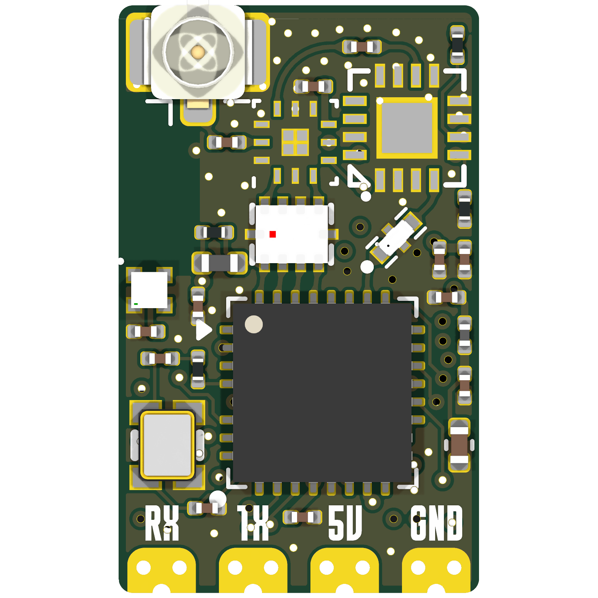
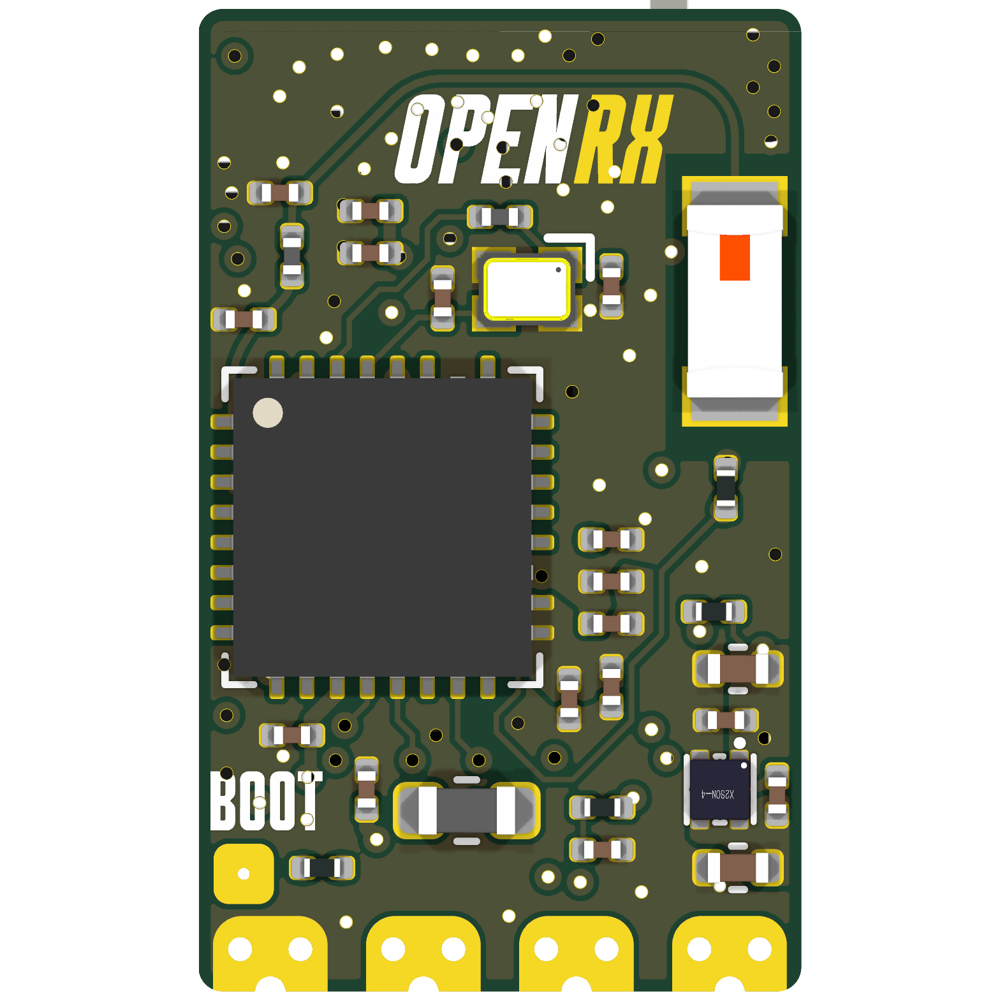

# OpenRX-Mono

Single-LR1121 dual-band receiver. ESP32-C3 + LR1121 (U3) + RFX2401C PA/LNA (U4) + SKY13373-460LF RF switch (U5) + Johanson 0900PC16J0042001E balun/IPD (T1).

## Board preview

| Front | Back |
|-------|------|
|  |  |

## Schematic

- Main sheet: `esp32c3_lr1121_mono.kicad_sch`
- 2.4 GHz path: `LR1121 RFIO_HF -> 2450FM07D0034T (FL1) -> RFX2401C TXRX -> PA/LNA -> RFX2401C ANT -> SKY13373 -> ANT -> J1 U.FL`
- Sub-GHz TX: `LR1121 RFO_HP_LF -> IPD (T1) TX_HP -> SKY13373 -> ANT -> J1 U.FL`
- Sub-GHz RX: `J1 U.FL -> ANT -> SKY13373 -> IPD (T1) RX -> LR1121 RFI_P/N_LF`
- IPD TX_LP is disconnected: ELRS never uses the LR1121 LP PA
- RF switch and front-end are driven by the LR1121's own DIOs, not ESP32-C3 GPIOs: `DIO5 -> RFX2401C RXEN`, `DIO6 -> RFX2401C TXEN`, `DIO7 -> SKY13373 V1`, `DIO8 -> SKY13373 V2`

### SKY13373 truth table (V1, V2)

| V1 | V2 | Path |
|---|---|---|
| 1 | 0 | 2.4 GHz TX/RX (RFX2401C ANT) |
| 0 | 1 | Sub-GHz TX HP (IPD TX_HP) |
| 1 | 1 | Sub-GHz RX (IPD RX) |
| 0 | 0 | Shutdown, antenna disconnected |

### 2450FM07D0034 impedance note

Filter pin 1 (chipset side) is 40 ohm, designed for SX1280/SX1281. LR1121 RFIO_HF is 50 ohm. The mismatch gives ~19 dB return loss (VSWR 1.25), only 0.05 dB mismatch loss: negligible. The filter's own internal return loss (14 dB typ) dominates. Kept as-is.

## Firmware

- ELRS target: `Unified_ESP32C3_LR1121_RX`
- Hardware JSON: `/shared/elrs-targets/OpenRX Mono LR1121.json`
- `radio_rfsw_ctrl: [15, 0, 12, 8, 8, 6, 0, 5]`; each byte is a DIO5-DIO8 bitmask passed to `SetDioAsRfSwitch` (bit0 = DIO5 RXEN, bit1 = DIO6 TXEN, bit2 = DIO7 V1, bit3 = DIO8 V2)
- `radio_dcdc: true`
- Requires the ExpressLRS fork branch (TCXO enable via `SetTcxoMode`): see [../FLASHING.md](../FLASHING.md) sections 1 and 10

### rfsw_ctrl decode

| Index | Mode | Value | DIO5 (RXEN) | DIO6 (TXEN) | DIO7 (V1) | DIO8 (V2) |
|---|---|---|---|---|---|---|
| 0 | Enable | 15 | on | on | on | on |
| 1 | Standby | 0 | 0 | 0 | 0 | 0 |
| 2 | Sub-GHz RX | 12 | 0 | 0 | 1 | 1 |
| 3 | Sub-GHz TX LP | 8 | 0 | 0 | 0 | 1 |
| 4 | Sub-GHz TX HP | 8 | 0 | 0 | 0 | 1 |
| 5 | 2.4 GHz TX | 6 | 0 | 1 | 1 | 0 |
| 6 | unused | 0 | - | - | - | - |
| 7 | 2.4 GHz RX | 5 | 1 | 0 | 1 | 0 |

### GPIO map

| GPIO | Function |
|---|---|
| 1 | IRQ (DIO1) |
| 2 | RST |
| 3 | BUSY |
| 4 | MOSI |
| 5 | MISO |
| 6 | SCK |
| 7 | NSS |
| 8 | LED |
| 9 | BOOT |

## Flash interface

- Pads: `5V`, `GND`, `RX`, `TX`
- `BOOT` pad (TP5): short to GND during power-up to enter UART download mode (no button on the Mono)
- Wi-Fi OTA after first flash. Full procedures: [../FLASHING.md](../FLASHING.md)

## Sourcing

- `C150853` SKY13373-460LF
- `C19842466` 0900PC16J0042001E: consign from DigiKey, 0 LCSC stock
- `C7498014` LR1121IMLTRT
- `C2651081` 2450FM07D0034T
- `C783588` RFX2401C
